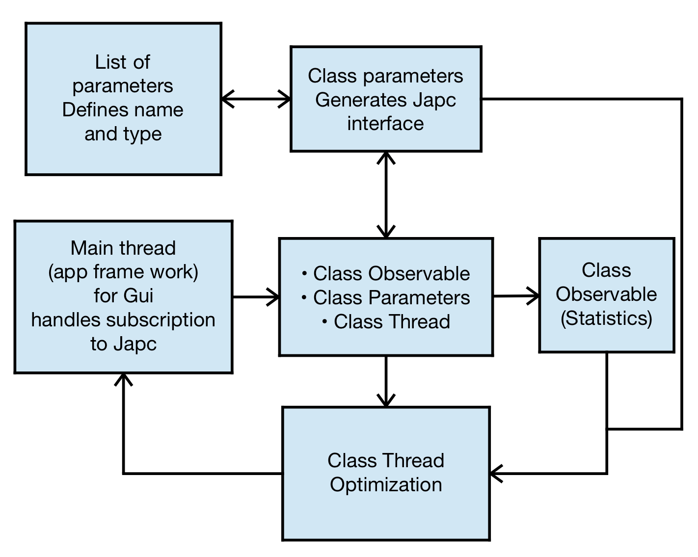

# ZS_optimizer

1. To run the application run main in ipython
2. Tip: To add todos in spyder just write # TODO: what I want to to somwhere in the code
3. If you are not shure which way to go type ">>> import this" in python

